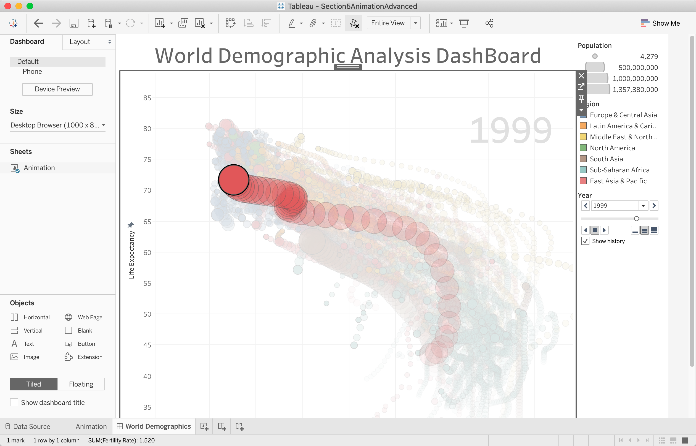
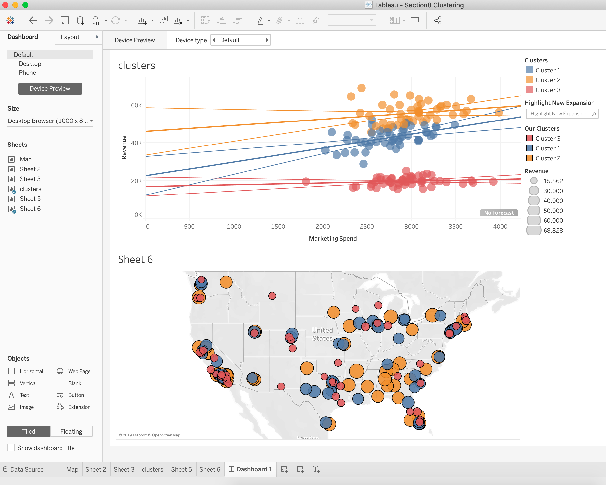
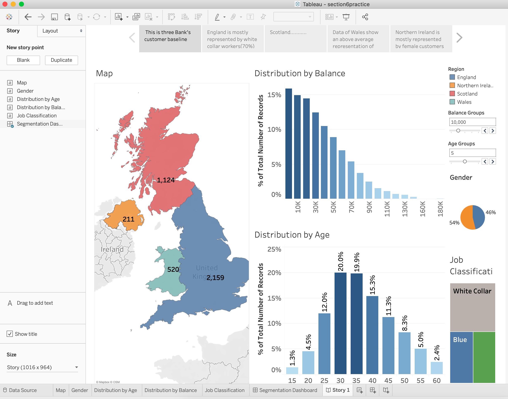
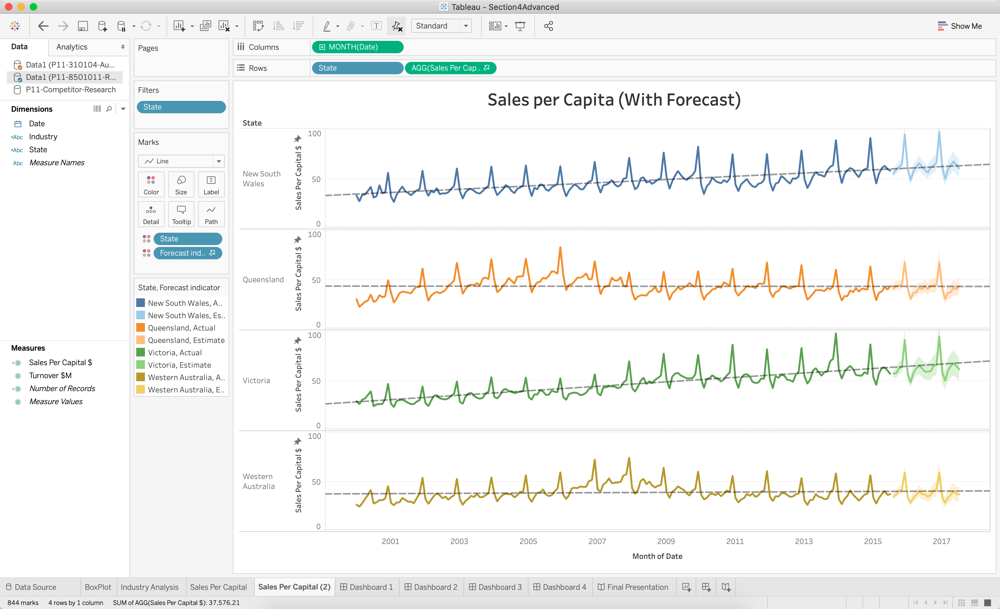

# Interesting Tableau Visualizations

#### This is a animation Visualizations that describes the change of life expectancy with years for different countries.

#### This is a clustering Visualization. I made 3 different clusters based on 3 different performance. Orange ones has higher growth rate for store in US. And this assist managers to make decision that which store should be invest more and which store should be invest less.

#### This is a Visualization of a bank data. And showing balance histograms and its possible distributions and relevant information.

#### This is a Visualizations showing Revenue over 15 years by month for different region. And also the forecast of the future Revenue.

